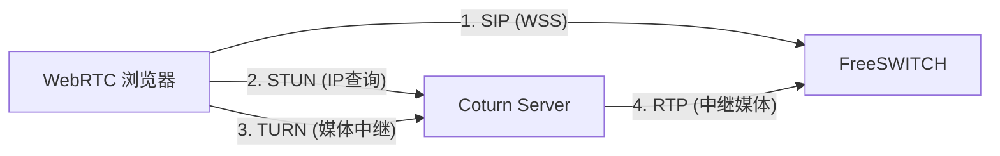

# Coturn (TURN Server) 部署与 FreeSWITCH 对接指南

## 1. 为什么需要 Coturn？

在 WebRTC 通话中（如浏览器坐席），如果客户端处于严格的防火墙后（对称 NAT）或跨运营商网络（如移动访问电信），P2P 连接往往会失败。

**Coturn** 的作用是作为中继服务器（Relay），强制转发音视频流，确保 **100% 的接通率**。

### 架构图



---

## 2. 快速部署 (Docker Compose)

建议将 Coturn 部署在有公网 IP 的服务器上（可以是 FreeSWITCH 同一台，也可以独立部署）。

### docker-compose.yml

```yaml
version: '3.8'

services:
  coturn:
    image: coturn/coturn:4.6.2
    container_name: coturn
    restart: always
    network_mode: host  # 强烈建议 host 模式，否则端口映射会消耗大量 CPU
    
    environment:
      # 填写你的公网 IP (必须配置，否则无法中继)
      - EXTERNAL_IP=1.2.3.4
    
    volumes:
      - ./turnserver.conf:/etc/coturn/turnserver.conf
```

### turnserver.conf (配置文件)

请创建 `turnserver.conf` 文件并填入以下内容：

```conf
# 监听端口
listening-port=3478
tls-listening-port=5349

# 对应 docker-compose 中的 EXTERNAL_IP，或者直接写死在这里
external-ip=1.2.3.4

# 域名 (随意写，作为 Realm 标识)
realm=rtc.yourcompany.com

# 端口范围 (与 FreeSWITCH RTP 范围错开，避免冲突)
min-port=49152
max-port=65535

# 日志
log-file=stdout
simple-log

# --- 认证配置 (核心) ---

# 方式一: 固定账号 (仅测试用，不安全)
# user=admin:123456

# 方式二: 动态令牌认证 (生产环境推荐)
# 允许使用时间戳生成的临时密码
use-auth-secret
static-auth-secret=YourSuperSecretKey123
# 只有带正确签名的请求才被允许
no-auth-ping
```

---

## 3. 对接 FreeSWITCH

我们需要告诉 FreeSWITCH：“请把这个 TURN 服务器的地址和临时密码下发给浏览器”。

**目标文件**: `conf/sip_profiles/internal.xml` (或您用于 WebRTC 的 profile)

在 `<settings>` 标签中添加/修改以下参数：

```xml
<!-- 1. 定义 TURN 服务器地址 -->
<!-- 注意: 必须是公网 IP 或域名 -->
<param name="stun-server" value="1.2.3.4:3478"/>
<param name="turn-server" value="1.2.3.4:3478:udp"/>

<!-- 2. 开启临时认证机制 -->
<param name="credential-mechanisms" value="turn-rest-auth"/>

<!-- 3. 配置认证密钥 (必须与 turnserver.conf 中的 static-auth-secret 一致) -->
<param name="turn-rest-auth-shared-secret" value="YourSuperSecretKey123"/>

<!-- 4. (可选) 配置令牌过期时间，默认 86400 秒 -->
<param name="turn-rest-auth-token-ttl" value="86400"/>
```

**原理说明**:
当浏览器发起 WebRTC 呼叫时，FreeSWITCH 会自动计算一个临时用户名（通常是时间戳）和密码（基于 Shared Secret 的 HMAC-SHA1 签名），并通过 SIP 消息（ICE Candidate）下发给浏览器。浏览器拿着这个临时凭证去连接 Coturn，Coturn 验证签名通过后，才允许中继流量。

---

## 4. 验证测试

### 4.1 测试 Coturn 服务
访问 [Trickle ICE](https://webrtc.github.io/samples/src/content/peerconnection/trickle-ice/) 网站。
1.  删除默认的 Google STUN 服务器。
2.  添加你的服务器:
    *   URI: `turn:1.2.3.4:3478`
    *   Username: (你需要手动用代码生成一个临时账号，或者暂时在 conf 里开启 `user=test:test` 来测试)
    *   Password: ...
3.  点击 **Gather candidates**。
4.  如果看到类型为 **relay** 的候选者出现，说明 TURN 服务工作正常。

### 4.2 联调测试
1.  重启 FreeSWITCH 和 Coturn。
2.  打开浏览器控制台 (F12)。
3.  发起 WebRTC 呼叫。
4.  查看 Console 日志，寻找 `ICE` 相关的输出。如果看到类似 `candidate: ... typ relay ...` 的日志，说明浏览器成功获取到了 TURN 中继地址。
5.  如果通话接通且有声音，即使在 4G/5G 网络下，说明配置成功。

---

## 5. 常见问题

**Q: 为什么配置了 TURN 还是单向声音？**
A: 检查云服务器的 **安全组 (Security Group)**。
Coturn 需要开放：
*   **TCP/UDP 3478** (信令)
*   **UDP 49152-65535** (媒体数据转发) <- **这一步最容易被遗忘！**

**Q: FreeSWITCH 和 Coturn 在同一台机器，端口冲突怎么办？**
A: 
*   FreeSWITCH 默认 RTP 端口是 `16384-32768`。
*   Coturn 我们配置了 `49152-65535`。
*   两者完全错开，不会冲突。只要不占用 SIP 的 5060/5080 即可。
